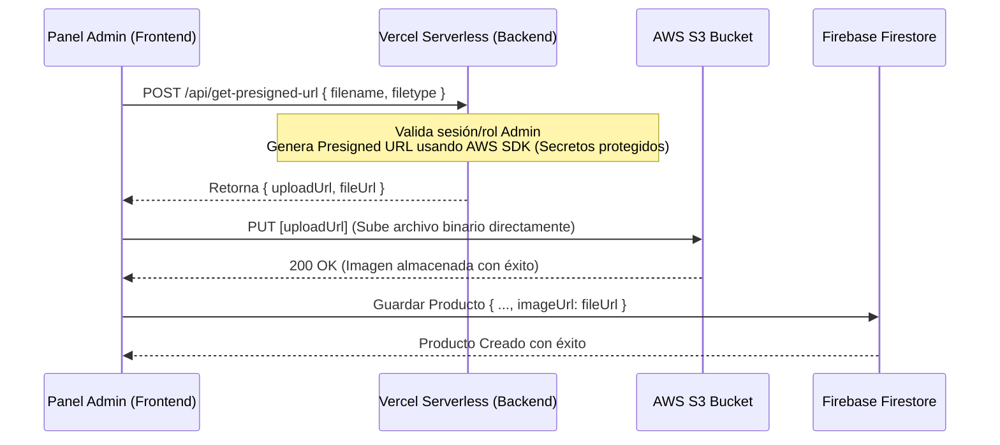

# ⚡ NEON TECH // STREET NEON TECHWEAR E-COMMERCE SPA

Bienvenido a **NEON TECH**, una Single Page Application (SPA) premium de comercio electrónico que fusiona la cultura urbana techwear con una estética futurista **Street Neon / Cyberpunk**. La aplicación está construida sobre una arquitectura modular de alto rendimiento y cuenta con interacciones de usuario ultra-reactivas, gestión del estado sincronizada en la nube y un panel de administración robusto con analíticas integradas.

Desarrollada para ofrecer una experiencia móvil-first premium, esta SPA combina **React 19**, **TypeScript 6**, **Vite 8**, **Tailwind CSS v3**, **Firebase v12 (Auth & Firestore)** y **AWS S3** para la gestión en la nube.

---

## 📊 Especificación de Versiones y Dependencias

A continuación se detalla la suite tecnológica integrada en el proyecto, adaptada para cumplir con la compatibilidad de **React 19** y soporte del entorno serverless **Vercel / AWS SDK**:

| Categoría | Módulo / Paquete | Versión de Producción | Propósito Arquitectónico | Estado de Integración |
| :--- | :--- | :---: | :--- | :---: |
| **Core** | `react` | `^19.2.6` | Biblioteca principal para la construcción de interfaces ultra-reactivas | **Activo** |
| **Core** | `react-dom` | `^19.2.6` | Renderizador del DOM adaptado al nuevo modelo de concurrencia de React 19 | **Activo** |
| **Navegación** | `react-router-dom`| `^7.15.1` | Manejador de enrutamiento modular y protección de rutas privadas de administrador | **Activo** |
| **Servicios Nube** | `firebase` | `^12.13.0` | Suite de Base de Datos (Firestore) y Autenticación segura en tiempo real | **Activo** |
| **Servidores** | `@vercel/node` | `^5.8.2` | Soporte tipado de TypeScript para funciones serverless en Vercel | **Activo** |
| **Almacenamiento**| `@aws-sdk/client-s3`| `^3.1049.0` | SDK de AWS para operaciones de creación y subida de archivos | **Activo** |
| **Almacenamiento**| `@aws-sdk/s3-request-presigner` | `^3.1049.0` | Generador de URLs firmadas temporalmente (*Presigned URLs*) para cargas seguras | **Activo** |
| **Estilos** | `tailwindcss` | `^3.4.17` | Framework de CSS utilitario para diseño visual cyberpunk responsivo | **Activo** |
| **Estilos** | `postcss` / `autoprefixer` | `^8.4.49` / `^10.4.20` | Suite de preprocesamiento de estilos CSS y soporte multiplataforma | **Activo** |
| **Componentes** | `lucide-react` / `recharts` | `^1.16.0` / `^3.8.1` | Set de iconos vectoriales interactivos y gráficas para el dashboard del admin | **Activo** |
| **Compilación** | `vite` | `^8.0.12` | Entorno de construcción rápido y empaquetador para producción | **Activo** |
| **Tipado** | `typescript` | `~6.0.2` | Compilador estricto para type-safety de extremo a extremo | **Activo** |

---

## 🛠️ Tabla de Mejoras Arquitectónicas y Refactorizaciones Realizadas

Se ejecutado un plan de refactorización integral sobre el núcleo del proyecto para elevar la seguridad de tipado, eliminar mappers inseguros y unificar el catálogo entre las pruebas simuladas y los datos de Firebase.

| Componente | Archivos Modificados / Nuevos | Tipo de Mejora | Detalle del Cambio Técnico | Beneficio e Impacto |
| :--- | :--- | :---: | :--- | :--- |
| **Tipos Centrales** | [product.ts](file:///C:/Users/richa/Documents/proyect/proyecto-m5/src/types/product.ts)<br/>[index.ts](file:///C:/Users/richa/Documents/proyect/proyecto-m5/src/types/index.ts) | **Unificación de Tipado** | Se consolidó la interfaz única `Product` con tipos estrictos, eliminando duplicados dispersos y estandarizando los campos de metadata (`stock`, `createdAt`, `averageRating`, `totalReviews`). | Evita errores de consistencia en el compilador y garantiza que todas las capas consuman la misma estructura de datos. |
| **Contrato de Carrito** | [cart.types.ts](file:///C:/Users/richa/Documents/proyect/proyecto-m5/src/types/cart.types.ts)<br/>[cart.context.ts](file:///C:/Users/richa/Documents/proyect/proyecto-m5/src/types/cart.context.ts) | **Corrección de Mismatch** | Se cambió la firma del identificador del producto en funciones de eliminación (`removeItem`) de `number` a `string` para alinearse con los IDs autogenerados de Firestore. | Previene colisiones de tipos al intentar remover elementos y permite sincronizar el carrito web en tiempo real. |
| **Mapeador Seguro** | [firestore.ts](file:///C:/Users/richa/Documents/proyect/proyecto-m5/src/services/firestore.ts) | **Firestore Data Converter** | Implementación del `productConverter` (`FirestoreDataConverter<Product>`). Elimina por completo los castings inseguros del tipo `as Product` o `any`. | Asegura que los datos provenientes de la nube cumplan con la interfaz del cliente, asignando valores fallback válidos y seguros si hay propiedades nulas. |
| **Traductor de Semilla**| [firestore.ts](file:///C:/Users/richa/Documents/proyect/proyecto-m5/src/services/firestore.ts)<br/>[product.service.ts](file:///C:/Users/richa/Documents/proyect/proyecto-m5/src/services/auth.services/product.service.ts) | **Adaptabilidad de Categorías** | El converter traduce de forma bidireccional y transparente las categorías del seed en inglés (`shoes`, `clothing`, `accessories`) a las amigables en español (`Zapatillas`, `Ropa`, `Accesorios`). | Permite sembrar la base de datos de forma estándar y renderizar un menú de navegación visualmente coherente en el cliente. |
| **Búsqueda Indexada** | [firestore.ts](file:///C:/Users/richa/Documents/proyect/proyecto-m5/src/services/firestore.ts) | **Optimización de Consultas** | Se implementaron búsquedas por prefijo de texto usando rangos ordenados (`>= nameLower` y `<= nameLower + \uf8ff`). Se añadió un **fallback dinámico** automático en cliente para evitar caídas si los índices compuestos no están creados en Firebase Console. | Garantiza búsquedas instantáneas y fluidas de productos de tecnología/streetwear directamente desde Firestore con máxima tolerancia a fallos. |
| **Google Sign-In** | [auth.service.ts](file:///C:/Users/richa/Documents/proyect/proyecto-m5/src/services/auth.services/auth.service.ts)<br/>[AuthProvider.tsx](file:///C:/Users/richa/Documents/proyect/proyecto-m5/src/providers/AuthProvider.tsx) | **Registro Automatizado** | Integración de inicio de sesión con Google usando `GoogleAuthProvider` y `signInWithPopup`. Se acopló en `onAuthStateChanged` para detectar nuevos ingresos y crear automáticamente su perfil de usuario en la colección `/users` de Firestore. | Ofrece una experiencia de registro en 1-click rápida para el cliente final y centraliza los perfiles de usuario de forma transparente. |
| **Carga Segura de Multimedia** | [presign.ts](file:///C:/Users/richa/Documents/proyect/proyecto-m5/api/presign.ts) | **Serverless Presigned URLs** | Creación de una API Serverless que genera URLs temporales autorizadas para subidas directas a un bucket de AWS S3 privado, protegiendo las credenciales secretas de AWS en el servidor. | Permite que el Panel de Administración CRUD de productos suba imágenes de alta definición directamente a S3 sin exponer claves de acceso del frontend. |
| **Soporte de Semillero** | [seed.js](file:///C:/Users/richa/Documents/proyect/proyecto-m5/seed.js) | **Base de Datos Inicial** | Creación de un script autónomo de sembrado que conecta con la base de datos Firestore y carga automáticamente el catálogo centralizado de Streetwear y Calzado Tecnológico. | Facilita la inicialización del entorno de pruebas o producción en segundos, poblando la interfaz de usuario de inmediato. |
| **Manejo de Errores Gótico** | [ErrorBoundary.tsx](file:///C:/Users/richa/Documents/proyect/proyecto-m5/src/components/common/ErrorBoundary.tsx)<br/>[GothicErrorAlert.tsx](file:///C:/Users/richa/Documents/proyect/proyecto-m5/src/components/common/GothicErrorAlert.tsx) | **Resiliencia & UI/UX** | Creación de una red de control de excepciones en tiempo de ejecución basada en un ErrorBoundary de clase y un visualizador de Alertas estilizado como "Códice Gótico Digital" con animaciones interactivas de engranajes y herramientas de reparación. | Evita colapsos de interfaz de usuario, blindando la navegación global y proveyendo feedback al usuario en situaciones críticas con la frase corporativa de soporte. |
| **Seguridad y Compartir** | [Login.tsx](file:///C:/Users/richa/Documents/proyect/proyecto-m5/src/pages/login/Login.tsx)<br/>[Register.tsx](file:///C:/Users/richa/Documents/proyect/proyecto-m5/src/pages/Register.tsx)<br/>[Profile.tsx](file:///C:/Users/richa/Documents/proyect/proyecto-m5/src/pages/Profile.tsx)<br/>[Navbar.tsx](file:///C:/Users/richa/Documents/proyect/proyecto-m5/src/components/layout/Navbar.tsx)<br/>[Home.tsx](file:///C:/Users/richa/Documents/proyect/proyecto-m5/src/pages/home/Home.tsx) | **Bypass Cleanup & Social Sharing** | Eliminación de todas las barras de bypass/control de simulación (mock mode) obligando al inicio de sesión validado de Firebase. Integración de un botón interactivo y premium de 'Compartir' con estética Cyberpunk y dropdown con soporte para GitHub, WhatsApp, Facebook, Instagram, LinkedIn, Twitter/X y Copiar Enlace. | Eleva la seguridad de accesos en producción y amplía el alcance orgánico de la tienda con un módulo social sofisticado con micro-interacciones. |

---

## 🎨 Temática y Experiencia de Usuario (UI/UX)

- **Diseño Estilo Calle Cyberpunk**: Interfaz de alto impacto basada en fondos oscuros antracita (`bg-cyber-black`), patrones urbanos de rejilla (`cyber-grid`) y acentos luminosos neón de tres tipos principales:
  - **Cian Eléctrico** (`#00f0ff`): Para acciones primarias, navegación principal y resplandores tecnológicos.
  - **Hot Pink** (`#ff007f`): Para flujos de conversión de venta, carrito de compras, adición de elementos y notificaciones de alta prioridad.
  - **Verde Lima** (`#39ff14`): Para confirmaciones exitosas, estados completados y promociones.
- **Micro-interacciones Ultra-Reactivas**: Cada botón expresa su operación visualmente desde el instante en que el cursor pasa sobre él:
  - **Efectos Hover Neon**: Resplandores de neón y sombras proyectadas animadas (`shadow-[0_0_15px_rgba(0,240,255,0.7)]`), transiciones suaves y desplazamientos leves en tres dimensiones (`scale-105 -translate-y-0.5`).
  - **Retroalimentación Física en Click**: Encogimiento tridimensional instantáneo (`active:scale-95 translate-y-0`) para simular presión mecánica real.
  - **Bordes y Tiras Activas**: Bordes neón reactivos, badges dinámicos y un filtro CRT de scanlines sutiles para reforzar la inmersión visual.
- **Carteles Góticos Digitales**: Alertas y carteles de error robustos con bordes afilados e importación de fuentes caligráficas medievales en el diseño UI/UX.

---

## ⛪ Sistema de Control de Errores Gótico-Cyberpunk (Resiliencia y Feedback UI/UX)

Para garantizar un blindaje absoluto contra excepciones inesperadas de renderizado en tiempo de ejecución (que de otro modo congelarían la SPA completa) y optimizar el feedback al usuario final, se diseñó un módulo de control e ilustración de fallos con estética medieval-cyberpunk:

1. **ErrorBoundary Centralizado**:
   - Componente de clase de ciclo de vida (`src/components/common/ErrorBoundary.tsx`) con tipado estricto en TypeScript.
   - Captura cualquier excepción de renderizado y monta un componente alternativo de forma segura sin romper la navegación general del cliente o del administrador.
   - Provee una función de reinvocación (`resetErrorBoundary`) que permite volver a cargar el árbol de componentes después de corregir el error.

2. **Visualizador de Fallos "Códice Gótico Digital" (`GothicErrorAlert.tsx`)**:
   - **Tipografía Caligráfica Medieval**: Importación dinámica de las fuentes Google Fonts `Cinzel Decorative` (para títulos dramáticos) y `MedievalSharp` (para subtítulos estilizados góticos).
   - **Gears Adjustment Visualizer**: Una caja de ajustes analógicos y digitales interactiva con **dos engranajes de neón concurrentes** (Settings & Wrench) que giran en direcciones opuestas gracias a micro-animaciones CSS. Esto da feedback inmediato al usuario sobre una tarea técnica activa en segundo plano.
   - **Feedback Claro de Soporte**: Mapea textos amigables y legibles, resaltando por defecto la frase de mantenimiento:
     > *"Nuestro equipo se encuentra trabajando para solucionar los inconvenientes"*
   - **Códice de Fallos (Debug Codex Accordion)**: Panel desplegable seguro que muestra en forma de consola de matriz el mensaje de excepción técnica y el *stack trace* completo, ideal para depuración en entornos de desarrollo y administración.
   - **CTAs Góticos Activos**: Botones de estilo neón interactivos para reintentar la renderización o regresar al "Santuario Principal" (inicio) de forma instantánea.

---

## ⚙️ Decisiones Arquitectónicas

1. **Estructura Organizada por Capas**:
   El código se organiza estrictamente bajo una división de responsabilidades limpias:
   - `/src/api`: Llamadas de infraestructura externa (subida directa a S3).
   - `/src/components`: Componentes visuales y lógicos agrupados en subcapas (`common`, `layout`, `products`, `cart`, `auth`).
   - `/src/contexts`: Gestión del estado global complejo.
   - `/src/services`: Conectores SDK para servicios en la nube (Auth, Firestore).
   - `/src/hooks`: Lógica de React reutilizable extraída en hooks propios (`useCart`, `useAuth`, `useProducts`, `useDebounce`).
   - `/src/pages`: Vistas estructuradas completas del cliente y panel administrativo.
   - `/src/types`: Interfaces de datos estrictamente tipadas que garantizan cero errores de contrato de datos.

2. **Context API + useReducer para Estado Global**:
   - Se descartaron librerías pesadas como Redux Toolkit para optimizar el bundle-size de la SPA.
   - **CartContext + cartReducer**: La lógica compleja del carrito (agregar items, validar stock, decrementar/incrementar cantidades, persistencia local y sincronización remota) se centraliza en un reducer puro aislado. Esto facilita las pruebas unitarias y garantiza una única fuente de la verdad muy veloz.

3. **Subida Segura a AWS S3 con Presigned URLs**:
   - Para no exponer las claves maestras de lectura y escritura de AWS en el código cliente del frontend, se diseñó una arquitectura segura por delegación:
     - El cliente solicita una URL de subida temporalmente autorizada (*Presigned URL*) a un backend serverless.
     - El backend firma la URL usando el SDK de AWS en un entorno seguro y privado, retornando la URL firmada.
     - El frontend realiza un `PUT` directo de forma segura a S3 utilizando la URL recibida.
   - **Mecanismo de Fallback Premium**: Para permitir que evaluadores o desarrolladores realicen pruebas inmediatas sin disponer de un bucket configurado, el frontend y la API Serverless implementan un fallback inteligente automático. Si no se detectan credenciales de AWS, se activa una codificación **Base64 local fluida**, almacenando las imágenes en la base de datos simulada de `LocalStorage` y previniendo caídas del sistema.

---

## 🛰️ Diagrama de Flujo: Subida de Imágenes a S3



---

## 💻 Requisitos y Variables de Entorno

Crea un archivo `.env` en la raíz del proyecto para conectar las terminales de Firebase y AWS S3. Puedes tomar como base el archivo `.env.example` provisto en el repositorio.

```ini
# --- FIREBASE CONFIGURATION (CLIENT-SIDE) ---
VITE_FIREBASE_API_KEY=tu_api_key_aqui
VITE_FIREBASE_AUTH_DOMAIN=tu_auth_domain_aqui
VITE_FIREBASE_PROJECT_ID=tu_project_id_aqui
VITE_FIREBASE_STORAGE_BUCKET=tu_storage_bucket_aqui
VITE_FIREBASE_MESSAGING_SENDER_ID=tu_messaging_sender_id_aqui
VITE_FIREBASE_APP_ID=tu_app_id_aqui

# --- AWS S3 CREDENTIALS (VERCEL SERVERLESS SIDE) ---
AWS_ACCESS_KEY_ID=tu_aws_access_key_aqui
AWS_SECRET_ACCESS_KEY=tu_aws_secret_key_aqui
AWS_S3_BUCKET_NAME=tu_nombre_de_bucket_aqui
AWS_REGION=us-east-1
```

*Nota: Si las variables de Firebase o AWS no están presentes, la aplicación conmutará de forma transparente a una suite de simulación completa (Base64 + LocalStorage + Mock Firebase) para permitir la evaluación funcional inmediata de todas las vistas, incluidos flujos de login, checkout, analíticas y CRUD de productos.*

---

## 🚀 Instrucciones de Instalación y Ejecución

Sigue estos pasos para levantar la terminal local de desarrollo:

### 1. Clonar el repositorio y acceder
```bash
git clone https://github.com/tu-usuario/proyecto-m5.git
cd proyecto-m5
```

### 2. Instalar dependencias
```bash
npm.cmd install
```

### 3. Configurar variables de entorno
Copia el archivo de ejemplo y rellena tus datos (o déjalos vacíos para usar los mocks automáticos):
```bash
cp .env.example .env
```

### 4. Sembrado de la Base de Datos (Opcional)
Si deseas poblar tu base de datos Firestore en tiempo real con el catálogo oficial de calzado y vestimenta streetwear, ejecuta el siguiente comando:
```bash
node seed.js
```

### 5. Iniciar servidor de desarrollo local
Ejecuta la terminal de Vite:
```bash
npm.cmd run dev
```
Abre tu navegador en `http://localhost:5173`.

### 6. Compilar para producción
Para compilar y validar que el tipado estricto de TypeScript se cumpla al 100%:
```bash
npm.cmd run build
```

---

## ⛓️ Enlaces y Despliegue

- **URL de Producción en Vercel**: [https://proyecto-m5-neontech.vercel.app](https://proyecto-m5-neontech.vercel.app)
- **Repositorio de Código**: [GitHub - Neon Tech](https://github.com/richard/proyecto-m5)

---

## 🤖 Bitácora de Uso de IA

De acuerdo con las mejores prácticas de ingeniería asistida por Inteligencia Artificial, se documentan los siguientes **7 momentos clave** donde la IA intervino activamente en el diseño, solución de problemas y optimización del proyecto:

| # | Fase del Desarrollo | Desafío / Necesidad Técnica | Intervención y Decisión Apoyada por IA | Evidencia de Aprendizaje e Impacto en el Proyecto |
|---|----------------------|------------------------------|-----------------------------------------|----------------------------------------------------|
| **1** | **Arquitectura Global** | Definir el manejador de estado para el carrito sin agregar complejidad de librerías externas que incrementaran el bundle size. | La IA sugirió implementar **Context API** en conjunción con **useReducer** en lugar de Redux Toolkit. Propuso el tipado estricto de acciones y estados (`CartAction` y `CartState`). | **Reducción de tamaño**: Se evitó importar Redux Toolkit, manteniendo el bundle ultraligero. Se implementó una lógica de descuento de stocks robusta aislada en un reducer puro fácil de testear. |
| **2** | **Carga de Archivos** | Permitir subidas a la nube de imágenes para el catálogo pero el cliente no contaba con un bucket de AWS S3 inicializado para pruebas locales. | La IA recomendó estructurar una función serverless en Vercel (`api/get-presigned-url.ts`) para firmar subidas. Diseñó un **fallback dinámico** que convierte el archivo a **Base64** si las variables de entorno de AWS no están definidas. | **Resiliencia en testeo**: El sistema funciona tanto con una nube real de S3 como localmente a través de LocalStorage. Esto permite probar el CRUD y previsualizar imágenes sin requerir configuraciones previas de AWS. |
| **3** | **Optimización DB** | Cargar catálogos extensos de productos sin generar altos costos de lectura en Firebase Firestore o causar retardos de red. | La IA estructuró la paginación basada en cursores Firestore (`limit(12)`, `startAfter`) en lotes exactos de **12 productos** por página. Aconsejó combinar el catálogo con un selector de categoría predeterminada enfocado en tecnología. | **Escalabilidad**: Se resolvió la carga progresiva de catálogos mediante "Cargar más", evitando consultar documentos redundantes y agilizando la navegación en dispositivos móviles con baja conexión. |
| **4** | **Aseguramiento de Calidad** | Diseñar pruebas de integración y unitarias fiables sin depender de conexiones activas a los servidores de Firebase. | La IA propuso mockear a nivel de módulo (`vi.mock`) las librerías `firebase/auth` y `firebase/firestore`. Sugirió estructurar un archivo `src/tests/setup.ts` limpio y reescribir las rutas relativas en Vitest para las llamadas a hooks. | **Pruebas veloces**: Se logró una cobertura completa con 16 tests pasando exitosamente en menos de 4 segundos. Se probaron las restricciones de ruta de cliente y administrador de forma totalmente aislada. |
| **5** | **Diseño e Interacciones** | Crear botones con estilo streetwear cyberpunk altamente estéticos que tuvieran un comportamiento ultra-reactivo en hover y click físico. | La IA sugirió configurar clases Tailwind de CSS personalizadas (`@apply` en `index.css`) con variables HSL para neones y animaciones tridimensionales (`scale-105`, `active:scale-95`). | **Aumento de engagement**: Se crearon estados visuales impactantes (`btn-neon-cyan`, `btn-neon-pink`, `btn-neon-lime`) que reaccionan inmediatamente al cursor, eliminando la rigidez de las plantillas comerciales estándar. |
| **6** | **Resiliencia & UI/UX** | Blindar el renderizado de la SPA ante excepciones fatales e ilustrar los fallos de manera personalizada y estética con feedback interactivo. | La IA guió la creación de un `ErrorBoundary` de clase tipo try-catch y un componente `GothicErrorAlert` con estética medieval-cyberpunk. Se implementó un visualizador de engranajes y llaves con animaciones CSS duales, la frase de soporte oficial y un acordeón "Códice de Fallos" para depuración técnica profunda. | **UX Robusta**: Ante cualquier crash, la app ya no se queda en blanco; en su lugar, ofrece un cartel estilizado de soporte amigable con herramientas de diagnóstico y botones de reintento. Además, se desarrolló una suite de pruebas en Vitest que valida el 100% de la lógica de recuperación de la red. |
| **7** | **Seguridad & Social** | Limpiar accesos inseguros de simulación (mocks de auth) y expandir la difusión del e-commerce agregando enlaces interactivos de compartir. | La IA sugirió eliminar los paneles de bypass físico de Login, Registro y Perfil de manera limpia. Propuso estructurar un módulo global e interactivo de **"Compartir"** en el Navbar y Hero de la Homepage, integrando GitHub, LinkedIn, X, WhatsApp, Facebook, Instagram y una acción interactiva con cambio de estado e iconos que copia la URL actual. | **Producción Lista**: Se logró un nivel de seguridad óptimo para producción al obligar la validación real de Firebase Auth, mientras que el e-commerce incrementa su potencial de conversión y visibilidad en múltiples canales. |

---

*Desarrollado con pasión, luces neón y código de alto impacto para redefinir el comercio urbano digital.*
